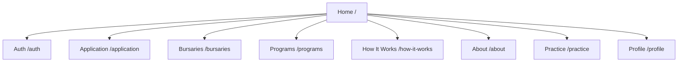

# Site Map

## Visual Structure

## Canonical Routes

1. / -> Startup
2. /auth -> AuthForm
3. /application -> Application
4. /bursaries -> Bursaryguest
5. /programs -> ProgramsGuest
6. /how-it-works -> How
7. /about -> About
8. /practice -> Practise
9. /profile -> Profile

## Backward-Compatible Legacy Routes

1. /AuthForm
2. /Aplication
3. /Bursaryguest
4. /Programsguest
5. /How
6. /About
7. /Practise
8. /Profile
